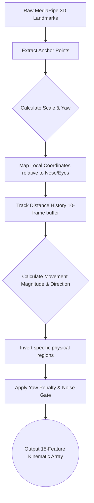

# EmoProsopon

Real-time facial kinematics and emotion recognition engine.

EmoProsopon breaks away from traditional static image classification. Instead of analyzing a single photograph to guess an emotion, it uses a high-performance **Kinematics Engine** to track the velocity, displacement, and mechanical choreography of 15 facial regions over a rolling 30-frame window. This temporal data is then fed into a PyTorch Long Short-Term Memory (LSTM) neural network to accurately identify human emotion as it unfolds in real-time.

---

## Table of Contents

1. [Getting Started](#getting-started)
2. [CLI Command Reference (eop)](#cli-command-reference-eop)
3. [Architecture & Developer Guide](#architecture--developer-guide)
   - [emoprosopon/ (Core Engine)](#1-emoprosopon-core-engine)
   - [downloaders/ (IO & Managers)](#2-downloaders-io--managers)
   - [sorters/ (Dataset Normalization)](#3-sorters-dataset-normalization)
   - [trainers/ (ML Pipeline)](#4-trainers-ml-pipeline)
4. [Licensing](#licensing)

---

## Getting Started

Setting up EmoProsopon is fully automated via our custom CLI orchestrator, `eop`.

1. **Install the Software:** Run the provided EmoProsopon installer for your operating system. This will extract the files and automatically add the `eop` command to your system PATH.
2. **Verify Installation:** Open your terminal and run:
   ```bash
   eop --version
    ```

3. **Run the Setup Wizard:** Initialize the environment, download the required Core AI models, and install Python dependencies by running and following the instructions:
```bash
eop --setup
```


Once setup is complete, you can launch the tracking engine at any time with `eop --start`.

*(Note: Pre-trained `.pth` models may be provided in releases. If your `checkpoints/` folder is empty, the UI will prompt you to run the training pipeline.)*

---

## CLI Command Reference (eop)

The `eop` command is your master orchestrator. It handles environment configuration, UI launching, and ML training pipelines.

### Core Commands

| Command | Short Flag | Description |
| --- | --- | --- |
| `eop --start` | `-s` | **Launch the main engine.** Opens the GUI launcher to select your input source (Camera, Video, or Screen). Requires pip dependencies and core models. |
| `eop --setup` | `-g` | **Run the first-time setup wizard.** Guides you through installing dependencies, downloading core models, and optionally fetching training datasets. |
| `eop --require` | `-r` | **Install Python dependencies.** Reads from `downloaders/requirements.txt` to install necessary packages (OpenCV, MediaPipe, PyTorch, etc.). |
| `eop --tui <target>` | `-t` | **Open an interactive TUI manager.** Replace `<target>` with `models`, `datasets`, or `extractor` to open the respective Terminal User Interface. |
| `eop --train [target]` | `-n` | **Run ML training pipeline.** Runs both harvesting and LSTM training sequentially. Optionally provide `harvest` or `model` to run only one specific stage. |
| `eop --version` | `-v` | **Show installed version.** Reads the current version from the `VERSION` file. |
| `eop --change-python` | `-cp` | **Reconfigure Python interpreter.** Resets your `.eop_config` and re-scans your system for available Python executables. |

### Advanced / Automation Commands

Use these commands for quick, non-interactive execution. Ideal for CI/CD, automation, or advanced users bypassing the TUIs.

* `eop --models --auto` : Download all missing Core AI models automatically.
* `eop --datasets <list>` : Download specific datasets (e.g., `eop --datasets CK+,MUG`).
* `eop --extractor --extract <list>` : Unpack specific downloaded datasets.
* `eop --extractor --sort <list>` : Run the dedicated sorter scripts on specific unpacked datasets.
* `eop --extractor --syd <list>` : **Extract and Sort.** Automatically performs both extraction and sorting on the provided datasets.

---

## Architecture & Developer Guide

EmoProsopon is highly modularized. The system is split into four distinct domains to separate IO handling, machine learning, and real-time rendering.

### 1. emoprosopon/ (Core Engine)

This directory houses the live real-time tracker and UI.

* `mainmenu.py`: The Tkinter graphical launcher.
* `HUD.py`: Handles the custom OpenCV overlay, occlusion toggles, and user inputs.
* `landmarks.py`: The main loop. It uses a YuNet Face Detector to find heads, isolates them, and passes them to MediaPipe for 3D mesh generation.

**The Kinematics Engine (`kinematics.py`)**
This is the mathematical core of the software. It translates static 3D points into normalized, scaling-resistant movement data.



### 2. downloaders/ (IO & Managers)

Contains the interactive TUIs and raw scripts for interacting with the web.

* `download_models.py`: Fetches `.onnx`, `.tflite`, and `.task` dependencies.
* `download_dataset.py`: A massive registry of both public and restricted emotional datasets, handling URLs, SSL bypasses, and file streaming.
* `extract_and_sort_dataset.py`: The orchestrator that unzips archives and triggers the `sorters`.

### 3. sorters/ (Dataset Normalization)

Because every university and research group formats their datasets completely differently (e.g., hiding labels in CSVs, nesting them in folders, or encoding them in filenames), we utilize bespoke sorting scripts.

**Adding a new dataset:** You do not need to modify the core downloader code. Simply write a `<datasetname>_sorter.py` script, place it in this folder, and the `extract_and_sort_dataset` orchestrator will automatically detect it and execute it. A valid sorter must move files into the `sorted_datasets/` directory, grouped by Title Case emotion names (e.g., `sorted_datasets/Happy/`).

### 4. trainers/ (ML Pipeline)

This isolates the heavy computational logic for training the neural network.

* `harvest_dataset.py`: Iterates through `sorted_datasets/`. It runs every video through the same YuNet -> MediaPipe -> Kinematics pipeline used in the live engine, forcing the output into standardized 30-frame sequence arrays (`X_features.npy`, `Y_labels.npy`).
* `train_emotion_model.py`: A PyTorch script featuring the `EmotionLSTM` architecture. It splits the harvested data into training/validation sets, applies dropout for regularization, and exports the optimal weights to `checkpoints/best_emo_model.pth`.

---

# Licensing

This project is licensed under a custom personal-use license.

You may freely use this code for personal, non-commercial purposes.

For commercial use, modification, or redistribution, please contact me for permission.

See the [LICENSE](https://www.google.com/search?q=./LICENSE) file for full terms.

